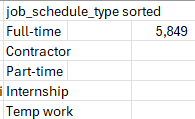

# Excel Salary Dashboard


## Introduction
I made this dashboard to help job seekers check salaries for their favorite jobs and make sure they get fair pay. 

The data includes details on job names, pay, locations, and skills.

## Dashboard File
My final dashboard is in [Job_Dashboard.xlsx](./Job_Dashboard.xlsx)

## Excel skills Used

I used these Excel tools: 
1. 📉 Charts 
2. 🧮 Formulas and Functions 
3. ❎ Data Validation

## Data Jobs Dataset
This project uses real data science job info from 2023
1. 👨‍💼 Job titles  
2. 💰 Salaries  
3. 📍 Locations  
4. 🛠️ Skills  

## Dashboard Build
📊 Data Science Job Salaries - Bar Chart


- 🛠️ Excel Features: Used a bar chart with money formats and a clean layout.
- 🎨 Design Choice: Sideways chart to compare middle salaries easily.
- 💡 Insights Gained: Shows pay trends quickly, proving that Senior jobs and Engineers get paid more than Analysts.

#

🗺️ Country Median Salaries - Map Chart


- 🛠️ Excel Features: Used a map chart to show middle salaries around the world.
- 🎨 Design Choice: Added colors to show different pay levels in different areas.
- 📊 Data Representation: Showed the middle salary for every country with data.
- 👁️ Visual Enhancement: Made it very easy to see and understand global pay trends right away.
- 💡 Insights Gained: Helps you see big differences in global pay and highlights high and low paying places

## 🧮 Formulas and Functions
Median Salary by Job Titles
```
=MEDIAN(
IF(
    (jobs[job_title_short]=A2)*
    (jobs[job_country]=country)*
    (ISNUMBER(SEARCH(type,jobs[job_schedule_type])))*
    (jobs[salary_year_avg]<>0),
    jobs[salary_year_avg]
)
)
```
- 🔍 Multi-Criteria Filtering: Checks the job name, country, and work type, and ignores empty salaries.
- 📊 Array Formula: Uses the MEDIAN() tool with IF() to look at the data.
- 🎯 Tailored Insights: Gives exact pay details for specific jobs, places, and work types.
- 🔢 Formula Purpose: This fills the table below to show the middle salary for the choices made.  

## 🍽️ Background Table


## 📉 Dashboard Implementation


## ⏰ Count of Job Schedule Type
```
=FILTER(J2#,(NOT(ISNUMBER(SEARCH("and",J2#))+ISNUMBER(SEARCH(",",J2#))))*(J2#<>0))
```
- 🔍 Unique List Generation: Uses the FILTER() tool to remove words like "and" or commas, and ignores zero values.
- 🔢 Formula Purpose: This fills the table below to make a clean list of work types.

## 🍽️ Background Table


## 📉 Dashboard Implementation:


## ❎ Data Validation
Enhanced Data Validation: Using the clean list for drop-down menus in Job Title, Country, and Type helps because:
- 🎯 It forces users to pick only correct options.
- 🚫 It stops wrong typing.
- 👥 It makes the tool much easier to use.  


# Conclusion
I created this dashboard to show how salaries change across different data jobs. Applying the skills from my Data Science Master's program at Bologna University, I built this tool to help people make smart career choices. You can use it to explore how different countries and work types affect pay in the real world.
